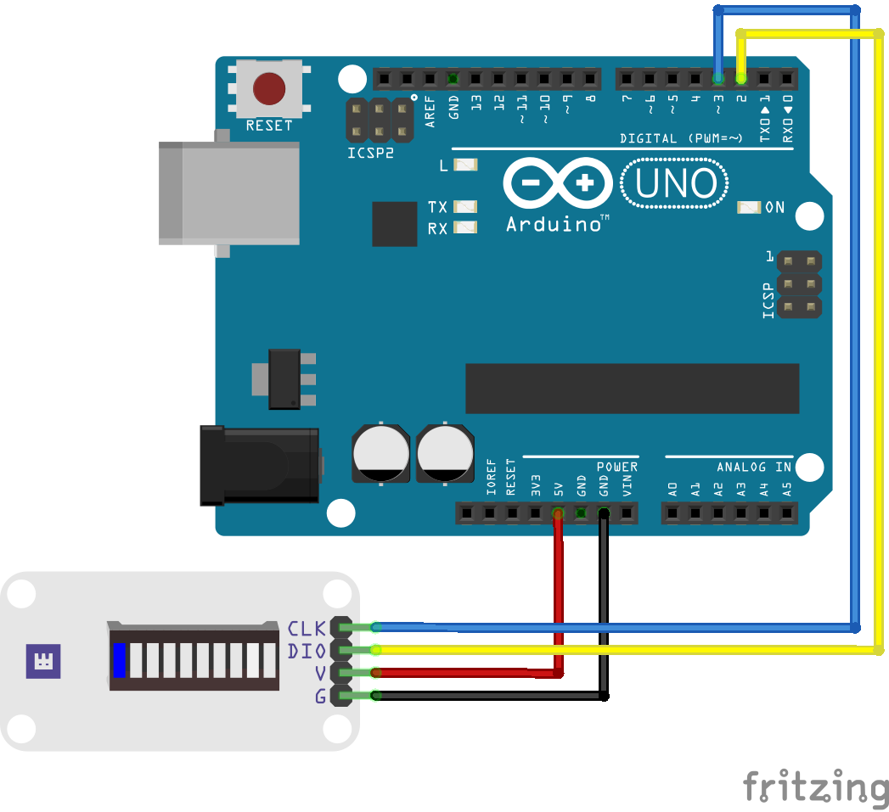

# Whadda bar graph module [](https://github.com/WhaddaMakers/bar_graph_module/actions/workflows/Arduino_CI.yml)

This repository contains the library and example code to work with our Whadda WPI471 LED bar graph module. The library can also be use to drive any other LED bar graph module that uses the TM1651 LED driver IC.


## Installation

Download the most recent version of the Arduino library using the Arduino library manager

## Example

### Wiring
Wire up the LED bar graph module to an Arduino compatible board as shown below:

|LED bar graph module|Arduino board|
|----------|-------------|
|CLK|D3|
|DIO|D2|
|V|5V|
|G|GND|




### Programming

1. Open the Arduino IDE, open the example sketch by going to ```File > Examples > Whadda LED bar graph > Demo``` (you might have to scroll down in the examples list to be able to see it)
2. Upload the example to your Arduino board
3. Enjoy the light show :)

The example program shows how you can use the LED bar graph module to display various patterns. It will cycle through 3 different display patterns that show the various functions that can be used with the LED bar graph.
